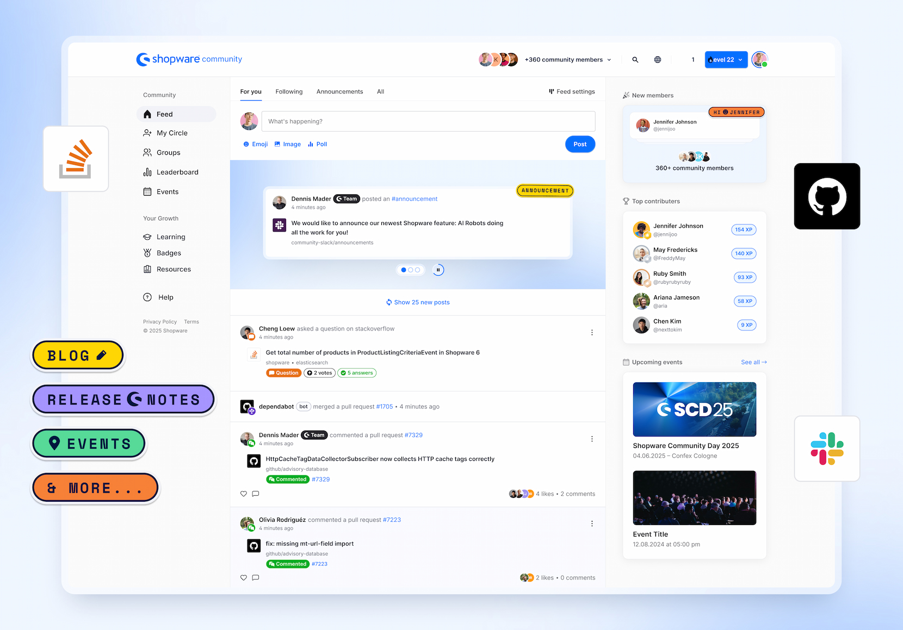

    

<h1 align="center">Shopware Community Hub</h1>

<strong>A community-driven platform to learn, grow, and connect.</strong>

[What is the Community Hub?](#what-is-the-community-hub) | [About this repository](#what-is-this-repository-about) | [Feature Requests & Ideas](#-feature-requests--ideas) | [Bug Reports & Accessibility Improvements](#-bug-reports--accessibility-improvements) | [Learning content](#-learning-content)

## What is the Community Hub?

The Shopware Community Hub is your central platform to learn, connect, and grow within the Shopware ecosystem. It consolidates courses, discussions, and community activities into one accessible space, making it easier than ever to stay engaged and informed. The Community Hub is open to everyone — developers, merchants, partners, and newcomers alike. Sign in with your Shopware Account, Slack Account, or GitHub Account and start exploring today:

👉 <a href="https://hub.shopware.com" target="_blank" rel="noopener noreferrer">hub.shopware.com</a>

### Key Features

* **Interactive Learning Paths:** Tailored, hands-on courses designed to match your role and learning goals, supported by a dedicated Shopware Learning Environment. 
* **Gamified Experience:** Earn experience points, badges, and climb leaderboards as you contribute and progress.
* **Centralized Resources:** Access live updates, tutorials, blog posts, podcasts, videos, and a community-driven events calendar—all in one place.
* **Community Engagement:** Join discussions, share knowledge, and collaborate with peers to foster a thriving community.

## What is this repository about?

This repository is the central place for collecting feedback related to the Shopware Community Hub. It enables open collaboration between users and the Shopware team and gives everyone the chance to help shape the platform.

You can contribute in the following ways:

### 💡 Ideas & Feature Requests

Have an idea to improve the Shopware Community Hub?
Please start a [Discussion](https://github.com/shopware/community-hub-feedback/discussions) under the Ideas category. This allows other community members to:

* Join the conversation
* Provide input and use cases
* Upvote the idea to help us prioritize

*Discussions give us a clearer view of community interest and help us shape the roadmap accordingly.*

### 🐞 Bug Reports & Accessibility Improvements

If you've encountered a bug, a specific accessibility issue, or if a feature behaves unexpectedly, please open a [Issue](https://github.com/shopware/community-hub-feedback/issues). Be sure to include:

* A clear description of the problem
* Steps to reproduce it
* Screenshots or error messages if available

*The team reviews and labels issues, provides status updates, and tracks their resolution here.*

### 📝 Learning content

If you want to give feedback on the learning content, please raise an idea on [Feedback](https://feedback.shopware.com/forums/963728-academy) under the Academy category. This allows other community members to:

* Provide input and use cases
* Upvote the idea to help us prioritize

*Our team will review the feedback.*